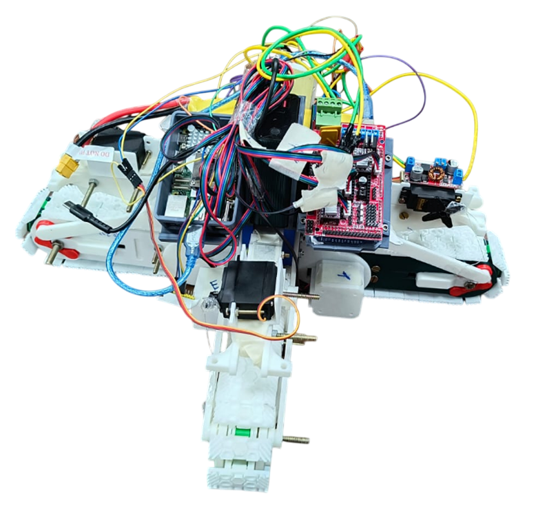
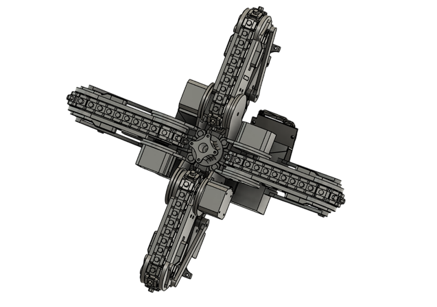

# X-Treads: An Omnidirectional Tread-Based Vehicle

## Overview

This repository documents the design and implementation of **X-Treads**, an experimental omnidirectional ground vehicle developed as a team project at IIT Indore.  

The vehicle uses **four tread modules arranged in an X-configuration** to achieve **eight-directional movement without yaw**, while retaining the robustness of tread-based locomotion on rough terrain.

## Motivation

Conventional wheeled and tread-based vehicles struggle with:

- Limited maneuverability (require turning radius).  

- High slippage/friction during diagonal movement.  

- Poor adaptability to irregular terrain.  

The X-Treads project explores whether **tread modules arranged in an X-shape** can combine the benefits of **omnidirectional mobility** (like mecanum wheels) with the **terrain adaptability of tracked systems**.

## Objectives

1. Design an **X-configured tread system** for omnidirectional mobility.  

2. Develop a **two-level control system** for directional command execution and feedback correction.  

3. Implement a **tread lifting mechanism** to minimize redundant friction during diagonal motion.  

4. Build a functional hardware prototype integrating **mechanical, electronic, and software subsystems**.  

## Mechanical & Hardware Design

- **Tread Configuration:** Four independent tread modules mounted in an X-shape.  

- **Tread Lifting:**  

  - Implemented using **servo motors and fishing line mechanisms**.  

  - Redundant treads lifted during diagonal motion to reduce drag.  

- **Chassis Design:** Fabricated lightweight frame to mount electronics and treads.  

## Electronics & Control

- **Raspberry Pi**: High-level controller running a **Pygame-based GUI** for user commands.  

- **Arduino Mega + RAMPS**: Low-level controller driving four stepper motors (one per tread).  

- **Servos**: Controlled tread lifting system.  

- **IMU (MPU6050)**: Provided orientation feedback for real-time correction.  

## Control Architecture

- **High-Level Controller:**  

  - User inputs directional commands (8 possible directions).  

  - Generates open-loop control signals for tread actuation.  

- **Low-Level Controller:**  

  - Processes IMU data to correct deviations in direction.  

  - Implements a feedback loop for **stable trajectory execution**.  

## Results

- Successfully demonstrated **omnidirectional movement** (forward, backward, lateral, and diagonal) without yaw.  

- **Tread lifting mechanism** reduced friction during diagonal travel, improving energy efficiency.  

- Control architecture allowed smooth execution of direction changes with real-time IMU correction.  

## Future Work

- Enhance tread lifting mechanism with **more robust actuators**.  

- Integrate **autonomous navigation algorithms** for self-driving capabilities.  

- Optimize tread design for **outdoor, uneven terrain operation**.  

## Repository Contents

- CAD models of X-Treads mechanical design.  

- Control code for Raspberry Pi (GUI) and Arduino Mega (motor + servo control).  

- IMU feedback integration scripts.  

- Experimental test data and performance evaluation.  

